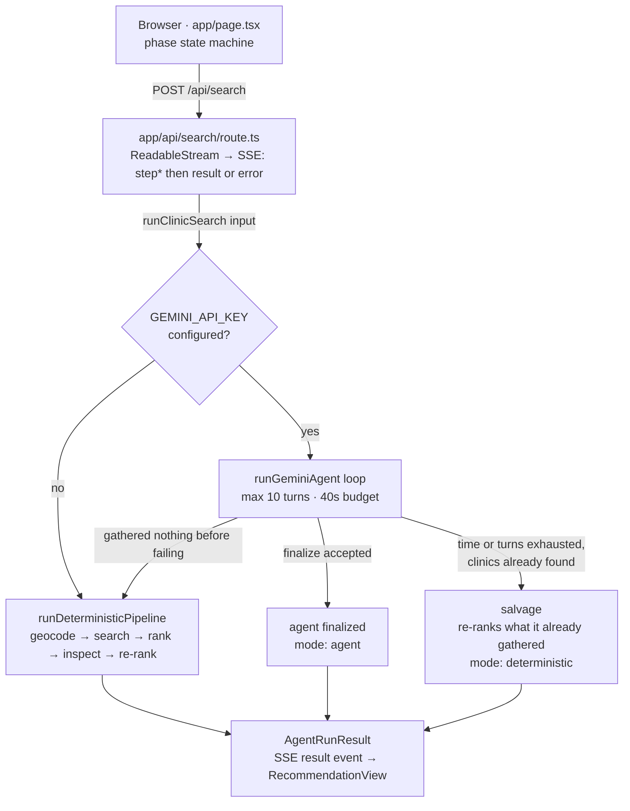
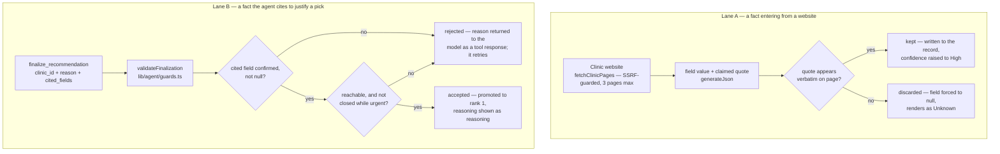

# Architecture

Where everything lives and how a search actually flows through it.

This is the structural view. [README.md](README.md) covers *why* the load-bearing
decisions were made — relevance filtering, urgency handling, surviving a busy
Overpass, reading hours without guessing. This document does not restate those
arguments; it shows the shape they produced.

## Request lifecycle

A search is one `POST` that stays open as a Server-Sent-Events stream. The client
never polls, and each step appears as it happens rather than replaying a canned
animation afterwards.

Which engine answers is decided by a single fork — but the deterministic pipeline
sits under three of the four paths out of it.



### The three ways a run ends

| Outcome | `mode` | When |
|---|---|---|
| Agent finalized | `agent` | The model called `finalize_recommendation` and it passed validation |
| Salvage | `deterministic` | The loop ran out of time or turns, or lost the model mid-run, but had already found clinics — that work is scored rather than thrown away and re-fetched |
| Fixed pipeline | `deterministic` | No key configured, or the agent failed before gathering anything |

All three produce the same `AgentRunResult` shape, so the client never learns to
treat one differently. The step log always names which engine answered and why —
which engine you got is exactly the sort of thing this app is otherwise careful
to be explicit about.

Not shown above: a geocoding or directory failure raises an `AgentError` before
either engine can produce anything. The route handler catches it and emits an SSE
`error` event, so that path exits *ahead* of the fork rather than after it.

### Budgets

The numbers are chained to the deployment ceiling, not picked freely:

- Vercel's Hobby plan kills a function at **60s** — `maxDuration` in
  [route.ts](app/api/search/route.ts).
- The agent loop gives itself **40s**, leaving room to fall back and still answer
  rather than dying mid-stream.
- **10 turns** max, because each turn is a network round-trip against the
  free-tier quota.

## Where state lives

The agent's blackboard is `RunState` ([lib/agent/state.ts](lib/agent/state.ts)),
and the boundary around it is the reason a model can be put in charge of a
medical lookup at all.

Full `Clinic` records live in `RunState` and **never enter the model's context**.
Tools hand the model a compact projection plus a short id (`node/123`), and read
the real record back out by id. Two things follow:

- A dense city's hundred listings cannot swamp the context window.
- It is structurally impossible for the model to alter a clinic fact. It can only
  ever point at one.

State that accumulates across a run: clinics found (deduped by id, surviving a
widened re-search with their inspection results intact), excluded specialty
listings, the radius actually searched, which clinics have been inspected, and
the finalization once accepted.

## The fact firewall

Two places ask the same question — is there anything behind this claim? — and
answer it the same way. Both discard rather than soften.



Lane A decides what a clinic record is allowed to *contain*. Lane B decides what
the agent is allowed to *say* about it. Lane B carries an extra gate Lane A does
not need, because a verified fact can still make for an unusable recommendation.

A rejection in Lane B is not a crash — it goes back as a `functionResponse` so
the model can correct the citation and try again, which is a real self-correction
loop rather than a hard failure.

### The usability floor

Letting the model overrule `rank_clinics` is the point of putting it in charge,
and most of that waterfall is genuinely a judgment call. Its top two tiers are
not — they answer "is this a usable recommendation at all", and a wrong call
there hands a sick person a clinic they cannot reach or one that is shut.

Both were observed happening in testing, which is why they are enforced in code
rather than requested in the prompt:

- **Reachability.** A listing with no address, phone, email or booking link is a
  name, not a recommendation. It cannot be finalized while any alternative can
  actually be reached or found.
- **Urgency.** A clinic confirmed closed cannot be finalized for an urgent
  request while any alternative might be open. Unknown hours pass — unknown might
  mean open — but a verified closure does not.

Each check only bites while a genuinely better option exists. If every clinic
nearby is a dead end, or every one is closed, saying so honestly is the best
answer available and the agent is left free to give it.

## Priority waterfall

[lib/tools/rankClinics.ts](lib/tools/rankClinics.ts) compares tier by tier, so a
tie falls through to the next criterion instead of collapsing into a single sort
key.

| Tier | Criterion | Note |
|---|---|---|
| 0 | Usable at all | No contact channel *and* no address sinks a listing to the bottom regardless of everything below |
| 1 | Open right now | Confirmed open beats unknown beats confirmed closed |
| 2 | Relevance | `walk_in` > `general` > `unknown` |
| 3 | Walk-ins explicitly confirmed | |
| 4 | Capacity or wait time known | |
| 5 | No appointment required | Skipped entirely for routine care — you can book ahead |
| 6 | Reachable by some contact channel | Deliberately above distance: a clinic you can phone beats one 100m closer that you cannot |
| 7 | Shortest distance | |
| 8 | Higher source confidence | |

The agent may recommend a lower-ranked clinic, but only by citing a *confirmed*
fact — distance, confidence and relevance are already weighed here, so an
override has to rest on something the waterfall could not see. An Unknown field
is never a reason to prefer a clinic; it is the absence of one.

## Module map

### Client

| Module | Role |
|---|---|
| [app/page.tsx](app/page.tsx) | Phase state machine — input, searching, progress, recommendation, error; owns the fetch and the SSE read loop |
| [components/InputForm.tsx](components/InputForm.tsx) | Location, urgency and radius |
| [components/SearchingState.tsx](components/SearchingState.tsx) | Pre-stream spinner; says so when the directory is slow past 12s |
| [components/AgentProgress.tsx](components/AgentProgress.tsx) | Live transparency log — one line per streamed step, paced by the run itself |
| [components/RecommendationView.tsx](components/RecommendationView.tsx) | Best pick, alternatives, agent rationale, set-aside specialty listings |
| [components/ClinicCard.tsx](components/ClinicCard.tsx) | One clinic, with a ✓ on each field quoted from the clinic's own site |
| [components/FieldValue.tsx](components/FieldValue.tsx) | The only renderer for a nullable field — `null` always prints "Unknown", never a guessed "No" |
| [components/ActionPanel.tsx](components/ActionPanel.tsx) | Renders whichever next action `determineAction` selected |
| [components/EmailDraftModal.tsx](components/EmailDraftModal.tsx) | Editable draft, explicitly mocked — nothing is ever sent |
| [components/EmergencyBanner.tsx](components/EmergencyBanner.tsx) | Sits above results when the request is emergency-adjacent |
| [components/ErrorState.tsx](components/ErrorState.tsx) | Renders an `AgentError` by kind, with a retry |
| [lib/sseClient.ts](lib/sseClient.ts) | Hand-rolled SSE frame parser — `EventSource` cannot issue a POST |
| [lib/determineAction.ts](lib/determineAction.ts) | Pure routing: book online, verified email, unverified email, call only, or no contact available |

### API

| Module | Role |
|---|---|
| [app/api/search/route.ts](app/api/search/route.ts) | The single POST endpoint; opens the stream and emits `step`, `result` and `error` events |

### Orchestration

| Module | Role |
|---|---|
| [lib/agent/index.ts](lib/agent/index.ts) | `runClinicSearch()` — picks the engine and always announces which one answered |
| [lib/runAgent.ts](lib/runAgent.ts) | `runDeterministicPipeline()` — the fixed pipeline, also the fallback |

### Agent internals

| Module | Role |
|---|---|
| [lib/agent/runGeminiAgent.ts](lib/agent/runGeminiAgent.ts) | The turn loop: system instruction, budget, turn cap, one nudge to finalize, salvage on early exit |
| [lib/agent/toolRegistry.ts](lib/agent/toolRegistry.ts) | The six callable tools, their declarations, and server-side clamps such as the radius ceiling |
| [lib/agent/state.ts](lib/agent/state.ts) | `RunState` blackboard and the projection boundary |
| [lib/agent/guards.ts](lib/agent/guards.ts) | `validateFinalization()` — the citation check and the usability floor |
| [lib/gemini/functionCall.ts](lib/gemini/functionCall.ts) | Gemini function-calling client; replays model parts verbatim to preserve thought signatures |

### Domain tools

| Module | Role |
|---|---|
| [lib/tools/geocode.ts](lib/tools/geocode.ts) | Nominatim lookup |
| [lib/tools/searchClinics.ts](lib/tools/searchClinics.ts) | Overpass query with retry and backoff; 24h cache that serves stale data rather than failing |
| [lib/tools/classifyClinic.ts](lib/tools/classifyClinic.ts) | Tiers a listing `walk_in` / `general` / `specialty` / `unknown` — downgrades only on positive evidence |
| [lib/tools/calculateDistance.ts](lib/tools/calculateDistance.ts) | Great-circle distance, labelled straight-line rather than routing |
| [lib/tools/rankClinics.ts](lib/tools/rankClinics.ts) | The waterfall above, plus the per-clinic rationale text |
| [lib/tools/inspectClinic.ts](lib/tools/inspectClinic.ts) | Runs one website's extraction, verification, caching and merge back into the record |
| [lib/tools/fetchPage.ts](lib/tools/fetchPage.ts) | SSRF-guarded fetch, HTML-to-text, same-origin link discovery for hours and contact pages |
| [lib/tools/gemini.ts](lib/tools/gemini.ts) | Single-shot structured-JSON extraction client; returns `null` on any failure |
| [lib/tools/verifyEvidence.ts](lib/tools/verifyEvidence.ts) | Quote verification, plus the separate gate on translated opening hours |
| [lib/tools/actionability.ts](lib/tools/actionability.ts) | `hasContactChannel` / `isLocatable` / `isDeadEnd` — shared by the ranking, the guards and the UI, so "we can contact this clinic" never means two different things |
| [lib/tools/cache.ts](lib/tools/cache.ts) | TTL cache with an injectable clock and a deliberate stale read |
| [lib/tools/draftAppointmentEmail.ts](lib/tools/draftAppointmentEmail.ts) | Pure template function |
| [lib/openingHours.ts](lib/openingHours.ts) | Conservative OSM `opening_hours` parser — unsupported syntax returns `null`, never a guess |

### Shared

| Module | Role |
|---|---|
| [lib/types.ts](lib/types.ts) | `Clinic`, `RankedClinic`, `AgentStep`, `AgentReasoning`, `AgentRunResult`, `AgentError` — shared across client and server |

## External services

All four are called server-side. Partly because Nominatim and Overpass require an
identifying `User-Agent` that browsers forbid setting, and partly to keep the
upstream services off the client's origin entirely.

| Service | Called by | Handling |
|---|---|---|
| OSM Nominatim | `geocode()` | 15s timeout. A location it cannot resolve is the user's to fix, so it surfaces as an error rather than being worked around |
| OSM Overpass | `search_clinics()` | `amenity=clinic\|doctors` within a radius. Two attempts with backoff on 429/5xx; falls back to expired cache before failing, and says so in the step log |
| Google Gemini | Agent loop (function calling) · website extraction (structured JSON) | Pinned to `gemini-2.5-flash`, 20s timeout. Quota errors named distinctly from network errors — they are different problems with different fixes |
| Clinic websites | `inspect_clinic_websites` | Untrusted: URLs come from publicly editable OSM tags. Hosts are DNS-resolved and rejected if they land in a private range; 8s timeout, 500KB and 15K-char caps, cross-origin links never followed |

## Testing

`lib/*.test.ts`, run with `node --test`. No network access — the agent loop takes
`callModel` and `runTool` as parameters precisely so a whole run can be driven
from a scripted transcript without a key.

Coverage leans toward the places where being wrong would be *dangerous* rather
than merely incorrect:

- `agentGuards.test.ts` — the citation check and both floors
- `agentLoop.test.ts` — budget and turn-cap termination, salvage, the finalize nudge
- `resolveInspection.test.ts` / `mergeInspection.test.ts` — cache-vs-fresh and website-vs-OSM precedence
- `openingHours.test.ts` — almost entirely about the parser refusing to guess
- `verifyEvidence.test.ts` — fabricated and paraphrased quotes dropping their fields
- `classifyClinic.test.ts` — specialty names beating walk-in names
- `cache.test.ts`, `fetchPageLinks.test.ts`, `sseClient.test.ts`, `actionability.test.ts`, `agentState.test.ts` — the supporting pure functions

```bash
npm test
```
