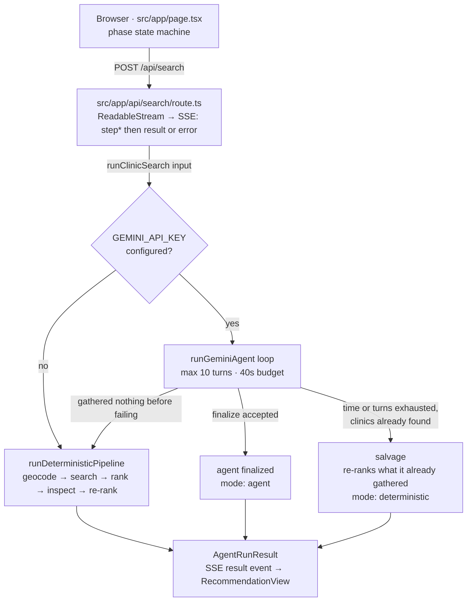
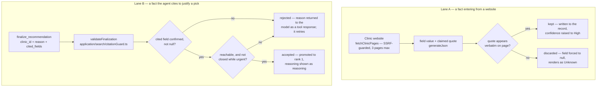
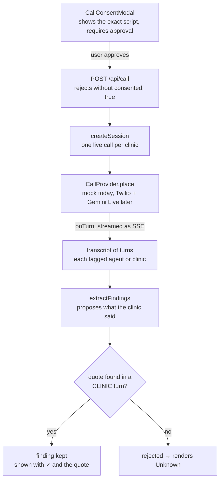

# Architecture

Where everything lives and how a search actually flows through it.

This is the structural view. [README.md](README.md) covers *why* the load-bearing
decisions were made — relevance filtering, urgency handling, surviving a busy
Overpass, reading hours without guessing. This document does not restate those
arguments; it shows the shape they produced.

## Layering

Code lives under `src/`, split by Clean Architecture layer rather than by
feature. Dependencies point inward only — `app/`/`components/` may depend on
`domain/` and on an application use-case's public entry point, `application/`
depends on `domain/` and on `application/ports/*` (never on a concrete
`infrastructure/` adapter), and `infrastructure/` implements those ports. An
ESLint rule (`eslint.config.mjs`) enforces the presentation-layer half of this
boundary — it fails the build if `components/` or `app/` (outside `app/api/`)
imports from `infrastructure/` directly.

| Layer | Path | What lives there |
|---|---|---|
| Presentation | `src/app/`, `src/components/` | Next.js routes and React components. Route handlers under `app/api/` are the exception allowed to wire in real use-cases and adapters. |
| Domain | `src/domain/` | Entities, pure policies, and verification logic. No network, no `process.env`, no framework. |
| Application | `src/application/` | Use-cases that orchestrate domain logic against ports, plus the ports themselves (`application/ports/`). |
| Infrastructure | `src/infrastructure/` | Concrete adapters — the only layer allowed `fetch`, DNS, or `process.env`. |
| Interface (transport) | `src/interface/http/` | Small, shared HTTP-framing helpers (the SSE response builder) used by route handlers. |
| Shared | `src/shared/` | Framework-agnostic code genuinely used by both client and server (SSE frame parsing). |

## Request lifecycle

A search is one `POST` that stays open as a Server-Sent-Events stream. The client
never polls, and each step appears as it happens rather than replaying a canned
animation afterwards.

Which engine answers is decided by a single fork — but the deterministic pipeline
sits under three of the four paths out of it.



### The three ways a run ends

| Outcome | `mode` | When |
|---|---|---|
| Agent finalized | `agent` | The model called `finalize_recommendation` and it passed validation |
| Salvage | `deterministic` | The loop ran out of time or turns, or lost the model mid-run, but had already found clinics — that work is scored rather than thrown away and re-fetched |
| Fixed pipeline | `deterministic` | No key configured, or the agent failed before gathering anything |

All three produce the same `AgentRunResult` shape, so the client never learns to
treat one differently. The step log always names which engine answered and why —
which engine you got is exactly the sort of thing this app is otherwise careful
to be explicit about.

Not shown above: a geocoding or directory failure raises an `AgentError` before
either engine can produce anything. The route handler catches it and emits an SSE
`error` event, so that path exits *ahead* of the fork rather than after it.

### Budgets

The numbers are chained to the deployment ceiling, not picked freely:

- Vercel's Hobby plan kills a function at **60s** — `maxDuration` in
  [route.ts](src/app/api/search/route.ts).
- The agent loop gives itself **40s**, leaving room to fall back and still answer
  rather than dying mid-stream.
- **10 turns** max, because each turn is a network round-trip against the
  free-tier quota.

## Where state lives

The agent's blackboard is `RunState` ([application/search/agentState.ts](src/application/search/agentState.ts)),
and the boundary around it is the reason a model can be put in charge of a
medical lookup at all.

Full `Clinic` records live in `RunState` and **never enter the model's context**.
Tools hand the model a compact projection plus a short id (`node/123`), and read
the real record back out by id. Two things follow:

- A dense city's hundred listings cannot swamp the context window.
- It is structurally impossible for the model to alter a clinic fact. It can only
  ever point at one.

State that accumulates across a run: clinics found (deduped by id, surviving a
widened re-search with their inspection results intact), excluded specialty
listings, the radius actually searched, which clinics have been inspected, and
the finalization once accepted.

## The fact firewall

Two places ask the same question — is there anything behind this claim? — and
answer it the same way. Both discard rather than soften.



Lane A decides what a clinic record is allowed to *contain*. Lane B decides what
the agent is allowed to *say* about it. Lane B carries an extra gate Lane A does
not need, because a verified fact can still make for an unusable recommendation.

A rejection in Lane B is not a crash — it goes back as a `functionResponse` so
the model can correct the citation and try again, which is a real self-correction
loop rather than a hard failure.

Both lanes share one primitive — [domain/verification/quoteMatch.ts](src/domain/verification/quoteMatch.ts)'s
`findVerbatimMatch()` — for "does this quote appear verbatim in one of these
sources". What differs per lane is what counts as a source: Lane A's whole page
text, or (for the call flow's parallel firewall, below) only the clinic's own
turns in a transcript. That distinction is enforced by what each lane
*constructs and passes in*, not by the shared primitive, so it cannot be
weakened by sharing code.

### The usability floor

Letting the model overrule `rank_clinics` is the point of putting it in charge,
and most of that waterfall is genuinely a judgment call. Its top two tiers are
not — they answer "is this a usable recommendation at all", and a wrong call
there hands a sick person a clinic they cannot reach or one that is shut.

Both were observed happening in testing, which is why they are enforced in code
rather than requested in the prompt:

- **Reachability.** A listing with no address, phone, email or booking link is a
  name, not a recommendation. It cannot be finalized while any alternative can
  actually be reached or found.
- **Urgency.** A clinic confirmed closed cannot be finalized for an urgent
  request while any alternative might be open. Unknown hours pass — unknown might
  mean open — but a verified closure does not.

Each check only bites while a genuinely better option exists. If every clinic
nearby is a dead end, or every one is closed, saying so honestly is the best
answer available and the agent is left free to give it.

## Agent-placed calls

A second, user-initiated flow that runs after a recommendation: the agent phones
the clinic and asks whether it is taking walk-ins. It is **inquire-only** — no
code path commits a booking — and **simulated**, against a scripted receptionist.

It is a separate flow rather than a seventh tool on the search agent for a
concrete reason: the search loop budgets 40s for an entire run, and a phone call
is minutes. Calls therefore get their own route, their own session store, and
their own stream.



The ordering is the safety property. A provider only ever produces **speech**;
turning speech into claimed facts, and claimed facts into confirmed ones,
happens after the line is down, in code the provider cannot influence. No
adapter — mock or live — can hand back a "finding", only words somebody said.

### Why the haystack excludes the agent's own turns

Half a transcript is the agent talking. An agent that asks a leading question
("so that's about forty-five minutes?") and receives a grunt could quote its own
sentence as evidence, converting its guess into a verified fact. Restricting the
haystack to clinic turns removes the possibility rather than discouraging it —
the same move the app makes everywhere else it puts a model near a claim.

### Constraints carried by the design

| Concern | Where it is enforced |
|---|---|
| Undisclosed AI caller | `DISCLOSURE` is a constant at index 0 of `buildScript`, never model-generated |
| Patient detail leaking | The script has one slot — the clinic name. `buildScript.length === 1` is asserted in the suite |
| Booking something unreviewed | No commitment path exists in this phase |
| Repeated calls to one clinic | `activeSessionFor` — one live session per clinic |
| A call that never ends | `MAX_CALL_MS`, plus the user's abort, combined into one signal in `runCall` |
| Mining a voicemail for facts | `buildOutcome` discards all findings unless the status is `completed` |

### Modules

| Module | Role |
|---|---|
| [domain/entities/call.ts](src/domain/entities/call.ts) | `CallSession`, `CallStatus`, `CallTurn`, findings, and the user-facing status notes |
| [domain/services/callScript.ts](src/domain/services/callScript.ts) | The bounded script, the disclosure, and the refusal/IVR/voicemail detectors |
| [application/ports/callSessionStore.ts](src/application/ports/callSessionStore.ts) | `CallSessionStore` — storage primitives; `callSessionService.ts` owns transition legality and one-call-per-clinic |
| [application/call/callSessionService.ts](src/application/call/callSessionService.ts) | Lifecycle state machine (transition legality, one-call-per-clinic) |
| [infrastructure/call/inMemoryCallSessionStore.ts](src/infrastructure/call/inMemoryCallSessionStore.ts) | The Map-based `CallSessionStore` — single process only |
| [infrastructure/call/redisCallSessionStore.ts](src/infrastructure/call/redisCallSessionStore.ts) | Redis-backed `CallSessionStore` — the one-call-per-clinic claim is a Redis SET-NX, atomic across instances |
| [infrastructure/call/createCallSessionStore.ts](src/infrastructure/call/createCallSessionStore.ts) | Picks Redis when `UPSTASH_REDIS_REST_URL`/`_TOKEN` are set, else the in-memory store |
| [domain/verification/transcriptEvidence.ts](src/domain/verification/transcriptEvidence.ts) | The clinic-turns-only firewall and `buildOutcome` |
| [application/call/extractFindingsUseCase.ts](src/application/call/extractFindingsUseCase.ts) | Proposes findings — Gemini when configured, a conservative sentence scan otherwise |
| [application/call/placeCallUseCase.ts](src/application/call/placeCallUseCase.ts) | Drives one call: dial, stream turns, extract, verify, record |
| [application/call/parseCallRequest.ts](src/application/call/parseCallRequest.ts) | Request-shape and consent validation, extracted out of the route handler |
| [application/ports/callProvider.ts](src/application/ports/callProvider.ts) | The `CallProvider` interface, shaped for Twilio Media Streams + Gemini Live |
| [infrastructure/call/mockCallProvider.ts](src/infrastructure/call/mockCallProvider.ts) | Seven scripted receptionists, one per real-world failure mode |
| [app/api/call/route.ts](src/app/api/call/route.ts) | POST + SSE; hanging up is the client aborting the fetch, via `request.signal` |
| [components/CallPanel.tsx](src/components/CallPanel.tsx) | Owns the flow; renders consent, progress and outcome |
| [components/CallConsentModal.tsx](src/components/CallConsentModal.tsx) | Renders the script from the same `buildScript` the call runs, so it cannot drift |
| [components/CallProgress.tsx](src/components/CallProgress.tsx) | Live turn-by-turn transcript with a hang-up control |
| [components/CallOutcomeCard.tsx](src/components/CallOutcomeCard.tsx) | Findings with ✓ and quote; rejected fields via `FieldValue` |

### Deferred to Phase 2

Live telephony, and the operational gating it requires: a verified caller ID, a
number allowlist, per-call rate limits, and jurisdiction review of AI-voice
disclosure rules. A real call also outlives its request, so it needs provider
webhooks — the session surviving past one request is the part a durable store
alone doesn't solve, since this phase's call still lives entirely inside one
held-open stream regardless of which `CallSessionStore` backs it.

## Priority waterfall

[domain/policies/rankClinics.ts](src/domain/policies/rankClinics.ts) compares tier by tier, so a
tie falls through to the next criterion instead of collapsing into a single sort
key.

| Tier | Criterion | Note |
|---|---|---|
| 0 | Usable at all | No contact channel *and* no address sinks a listing to the bottom regardless of everything below |
| 1 | Open right now | Confirmed open beats unknown beats confirmed closed |
| 2 | Relevance | `walk_in` > `general` > `unknown` |
| 3 | Walk-ins explicitly confirmed | |
| 4 | Capacity or wait time known | |
| 5 | No appointment required | Skipped entirely for routine care — you can book ahead |
| 6 | Reachable by some contact channel | Deliberately above distance: a clinic you can phone beats one 100m closer that you cannot |
| 7 | Shortest distance | |
| 8 | Higher source confidence | |

The agent may recommend a lower-ranked clinic, but only by citing a *confirmed*
fact — distance, confidence and relevance are already weighed here, so an
override has to rest on something the waterfall could not see. An Unknown field
is never a reason to prefer a clinic; it is the absence of one.

## Module map

### Presentation — client

| Module | Role |
|---|---|
| [app/page.tsx](src/app/page.tsx) | Phase state machine — input, searching, progress, recommendation, error; owns the search request |
| [components/InputForm.tsx](src/components/InputForm.tsx) | Location, urgency and radius |
| [components/SearchingState.tsx](src/components/SearchingState.tsx) | Pre-stream spinner; says so when the directory is slow past 12s |
| [components/AgentProgress.tsx](src/components/AgentProgress.tsx) | Live transparency log — one line per streamed step, paced by the run itself |
| [components/RecommendationView.tsx](src/components/RecommendationView.tsx) | Best pick, alternatives, agent rationale, set-aside specialty listings |
| [components/ClinicCard.tsx](src/components/ClinicCard.tsx) | One clinic, with a ✓ on each field quoted from the clinic's own site |
| [components/FieldValue.tsx](src/components/FieldValue.tsx) | The only renderer for a nullable field — `null` always prints "Unknown", never a guessed "No" |
| [components/ActionPanel.tsx](src/components/ActionPanel.tsx) | Renders whichever next action `determineAction` selected |
| [components/EmailDraftModal.tsx](src/components/EmailDraftModal.tsx) | Editable draft, explicitly mocked — nothing is ever sent |
| [components/EmergencyBanner.tsx](src/components/EmergencyBanner.tsx) | Sits above results when the request is emergency-adjacent |
| [components/ErrorState.tsx](src/components/ErrorState.tsx) | Renders an `AgentError` by kind, with a retry |
| [components/hooks/useStreamedSse.ts](src/components/hooks/useStreamedSse.ts) | Owns one POST-and-stream-SSE request's `AbortController`; used by both the search flow and `CallPanel` |
| [shared/sse/postAndStream.ts](src/shared/sse/postAndStream.ts) | The framework-agnostic fetch + content-type check + SSE read loop the hook wraps |
| [shared/sse/sseFrame.ts](src/shared/sse/sseFrame.ts) | Hand-rolled SSE frame parser — `EventSource` cannot issue a POST |
| [domain/policies/determineAction.ts](src/domain/policies/determineAction.ts) | Pure routing: book online, verified email, unverified email, call only, or no contact available |

### Interface — API

| Module | Role |
|---|---|
| [app/api/search/route.ts](src/app/api/search/route.ts) | Thin controller: parse → validate shape → `runClinicSearch` → SSE-frame events |
| [interface/http/sseResponse.ts](src/interface/http/sseResponse.ts) | Shared `ReadableStream`/encoder/abort-listener/close boilerplate for both SSE routes |
| [interface/http/errors.ts](src/interface/http/errors.ts) | Shared JSON error responder |

### Application — search orchestration

| Module | Role |
|---|---|
| [application/search/runClinicSearchUseCase.ts](src/application/search/runClinicSearchUseCase.ts) | `runClinicSearch()` — picks the engine and always announces which one answered |
| [application/search/runDeterministicPipelineUseCase.ts](src/application/search/runDeterministicPipelineUseCase.ts) | `runDeterministicPipeline()` — the fixed pipeline, also the fallback |
| [application/search/runGeminiAgentUseCase.ts](src/application/search/runGeminiAgentUseCase.ts) | The turn loop: system instruction, budget, turn cap, one nudge to finalize, salvage on early exit |
| [application/search/agentState.ts](src/application/search/agentState.ts) | `RunState` blackboard and the projection boundary |
| [application/search/citationGuard.ts](src/application/search/citationGuard.ts) | `validateFinalization()` — the citation check and the usability floor |
| [application/search/inspectClinicUseCase.ts](src/application/search/inspectClinicUseCase.ts) | Runs one website's extraction, verification, caching and merge back into the record |
| [application/search/tools/index.ts](src/application/search/tools/index.ts) | `AGENT_TOOLS`, `TOOL_DECLARATIONS`, `executeTool` |
| [application/search/tools/*.ts](src/application/search/tools/) | One file per tool (`geocodeTool`, `searchTool`, `inspectTool`, `rankTool`, `detailsTool`, `finalizeTool`), plus `shared.ts` (common types/helpers) and `stepMessages.ts` (the two step-log formatters complex enough to be worth naming) |

### Application — ports

| Module | Role |
|---|---|
| [application/ports/*.ts](src/application/ports/) | `Geocoder`, `ClinicDirectory`, `WebsiteFetcher`, `JsonExtractionModel`, `FunctionCallingModel`, `CallProvider`, `CallSessionStore`, `ConfigProvider`, `Clock` — the seams infrastructure adapters implement |

### Domain — entities, policies, verification

| Module | Role |
|---|---|
| [domain/entities/clinic.ts](src/domain/entities/clinic.ts) | `Clinic`, `RankedClinic`, `ClinicInspection`, `Evidence`, `clinicShortId` |
| [domain/entities/agentRun.ts](src/domain/entities/agentRun.ts) | `AgentStep`, `AgentReasoning`, `AgentRunResult`, `ActionCase`, `InputFormData` |
| [domain/entities/errors.ts](src/domain/entities/errors.ts) | `AgentError` |
| [domain/entities/call.ts](src/domain/entities/call.ts) | Call-flow entities (see Agent-placed calls, above) |
| [domain/policies/classifyClinic.ts](src/domain/policies/classifyClinic.ts) | Tiers a listing `walk_in` / `general` / `specialty` / `unknown` — downgrades only on positive evidence |
| [domain/policies/calculateDistance.ts](src/domain/policies/calculateDistance.ts) | Great-circle distance, labelled straight-line rather than routing |
| [domain/policies/rankClinics.ts](src/domain/policies/rankClinics.ts) | The waterfall above, plus the per-clinic rationale text |
| [domain/policies/actionability.ts](src/domain/policies/actionability.ts) | `hasContactChannel` / `isLocatable` / `isDeadEnd` — shared by the ranking, the guards and the UI |
| [domain/policies/excludeSpecialtyListings.ts](src/domain/policies/excludeSpecialtyListings.ts) | `partitionBySpecialty` — the specialty-exclusion rule shared by the agent path and the deterministic pipeline |
| [domain/policies/openingHours.ts](src/domain/policies/openingHours.ts) | Conservative OSM `opening_hours` parser — unsupported syntax returns `null`, never a guess |
| [domain/services/draftAppointmentEmail.ts](src/domain/services/draftAppointmentEmail.ts) | Pure template function |
| [domain/verification/quoteMatch.ts](src/domain/verification/quoteMatch.ts) | `findVerbatimMatch` — the primitive both fact-firewall lanes share |
| [domain/verification/pageEvidence.ts](src/domain/verification/pageEvidence.ts) | Quote verification against a fetched page, plus the separate gate on translated opening hours |

### Infrastructure — adapters

| Module | Role |
|---|---|
| [infrastructure/geo/nominatimGeocoder.ts](src/infrastructure/geo/nominatimGeocoder.ts) | Nominatim lookup; implements `Geocoder` |
| [infrastructure/geo/overpassClinicDirectory.ts](src/infrastructure/geo/overpassClinicDirectory.ts) | Overpass query with retry and backoff; 24h cache that serves stale data rather than failing; implements `ClinicDirectory` |
| [infrastructure/web/httpWebsiteFetcher.ts](src/infrastructure/web/httpWebsiteFetcher.ts) | SSRF-guarded fetch, HTML-to-text, same-origin link discovery; implements `WebsiteFetcher` |
| [infrastructure/llm/geminiHttpClient.ts](src/infrastructure/llm/geminiHttpClient.ts) | Shared POST/timeout/error-classification transport used by both Gemini adapters below |
| [infrastructure/llm/geminiJsonClient.ts](src/infrastructure/llm/geminiJsonClient.ts) | Single-shot structured-JSON extraction; implements `JsonExtractionModel`; returns `null` on any failure |
| [infrastructure/llm/geminiFunctionCallClient.ts](src/infrastructure/llm/geminiFunctionCallClient.ts) | Function-calling client; implements `FunctionCallingModel`; replays model parts verbatim to preserve thought signatures |
| [infrastructure/cache/cache.ts](src/infrastructure/cache/cache.ts) | `Cache<T>` — the shape both cache backends below implement |
| [infrastructure/cache/ttlCache.ts](src/infrastructure/cache/ttlCache.ts) | In-memory `Cache<T>` with an injectable clock and a deliberate stale read; single-process only |
| [infrastructure/cache/redisCache.ts](src/infrastructure/cache/redisCache.ts), [redisRestClient.ts](src/infrastructure/cache/redisRestClient.ts) | Redis-backed `Cache<T>` — same stale-read contract, holds across serverless instances; fails open on a transport error |
| [infrastructure/cache/createCache.ts](src/infrastructure/cache/createCache.ts) | Picks Redis when `UPSTASH_REDIS_REST_URL`/`_TOKEN` are set, else the in-memory cache — used by both cache call sites below |
| [infrastructure/config/env.ts](src/infrastructure/config/env.ts) | The one place `GEMINI_API_KEY`/`GEMINI_MODEL` are read from `process.env`; implements `ConfigProvider` |
| [infrastructure/call/mockCallProvider.ts](src/infrastructure/call/mockCallProvider.ts) | Call subsystem provider adapter (see Agent-placed calls, above) |

## External services

All four are called server-side. Partly because Nominatim and Overpass require an
identifying `User-Agent` that browsers forbid setting, and partly to keep the
upstream services off the client's origin entirely.

| Service | Called by | Handling |
|---|---|---|
| OSM Nominatim | `geocode()` | 15s timeout. A location it cannot resolve is the user's to fix, so it surfaces as an error rather than being worked around |
| OSM Overpass | `search_clinics()` | `amenity=clinic\|doctors` within a radius. Two attempts with backoff on 429/5xx; falls back to expired cache before failing, and says so in the step log |
| Google Gemini | Agent loop (function calling) · website extraction (structured JSON) | Pinned to `gemini-2.5-flash`, 20s timeout. Quota errors named distinctly from network errors — they are different problems with different fixes |
| Clinic websites | `inspect_clinic_websites` | Untrusted: URLs come from publicly editable OSM tags. Hosts are DNS-resolved and rejected if they land in a private range; 8s timeout, 500KB and 15K-char caps, cross-origin links never followed |

## Testing

`src/**/*.test.ts`, colocated beside the source each file tests, run with
`node --test`. No network access — the agent loop takes `callModel` and
`runTool` as parameters precisely so a whole run can be driven from a scripted
transcript without a key.

Coverage leans toward the places where being wrong would be *dangerous* rather
than merely incorrect:

- `citationGuard.test.ts` — the citation check and both floors
- `runGeminiAgentUseCase.test.ts` — budget and turn-cap termination, salvage, the finalize nudge
- `resolveInspection.test.ts` / `mergeInspection.test.ts` — cache-vs-fresh and website-vs-OSM precedence
- `openingHours.test.ts` — almost entirely about the parser refusing to guess
- `pageEvidence.test.ts` — fabricated and paraphrased quotes dropping their fields
- `classifyClinic.test.ts` — specialty names beating walk-in names
- `transcriptEvidence.test.ts` — the call firewall, including a quote lifted from the agent's own turn
- `callScript.test.ts` — disclosure first, and no slot able to carry patient detail
- `callSessionService.test.ts` — lifecycle transitions, hang-up at every live stage, one call per clinic
- `mockCallProvider.test.ts` — each persona's terminal status, and the vague clinic confirming nothing
- `redisCallSessionStore.test.ts` — the SET-NX claim, and a terminal status releasing it for the next call, against a fake transport
- `redisCache.test.ts` — the stale-read contract and failing open on a transport error, against a fake transport
- `excludeSpecialtyListings.test.ts` — the agent path and the deterministic pipeline agreeing on the same duplicate-chain input
- `ttlCache.test.ts`, `fetchPageLinks.test.ts`, `sseFrame.test.ts`, `actionability.test.ts`, `agentState.test.ts`, `fixedWindowRateLimiter.test.ts` — the supporting pure functions

```bash
npm test
```
