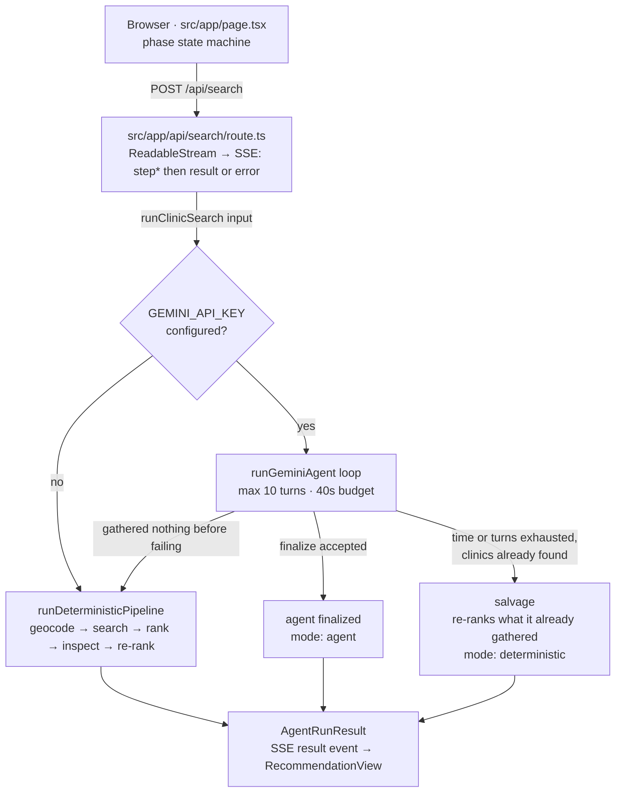
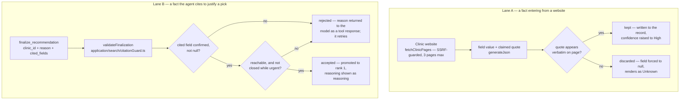

# Architecture

Where everything lives and how a search actually flows through it.

This is the structural view. [README.md](README.md) covers *why* the load-bearing
decisions were made — relevance filtering, urgency handling, surviving a busy
Overpass, reading hours without guessing. This document does not restate those
arguments; it shows the shape they produced.

## Layering

Code lives under `src/`, split by Clean Architecture layer rather than by
feature. Dependencies point inward only — `app/`/`components/` may depend on
`domain/` and on an application use-case's public entry point, `application/`
depends on `domain/` and on `application/ports/*` (never on a concrete
`infrastructure/` adapter), and `infrastructure/` implements those ports. An
ESLint rule (`eslint.config.mjs`) enforces the presentation-layer half of this
boundary — it fails the build if `components/` or `app/` (outside `app/api/`)
imports from `infrastructure/` directly.

| Layer | Path | What lives there |
|---|---|---|
| Presentation | `src/app/`, `src/components/` | Next.js routes and React components. Route handlers under `app/api/` are the exception allowed to wire in real use-cases and adapters. |
| Domain | `src/domain/` | Entities, pure policies, and verification logic. No network, no `process.env`, no framework. |
| Application | `src/application/` | Use-cases that orchestrate domain logic against ports, plus the ports themselves (`application/ports/`). |
| Infrastructure | `src/infrastructure/` | Concrete adapters — the only layer allowed `fetch`, DNS, or `process.env`. |
| Interface (transport) | `src/interface/http/` | Small, shared HTTP-framing helpers (the SSE response builder) used by route handlers. |
| Shared | `src/shared/` | Framework-agnostic code genuinely used by both client and server (SSE frame parsing). |

## Request lifecycle

A search is one `POST` that stays open as a Server-Sent-Events stream. The client
never polls, and each step appears as it happens rather than replaying a canned
animation afterwards.

Which engine answers is decided by a single fork — but the deterministic pipeline
sits under three of the four paths out of it.



### The three ways a run ends

| Outcome | `mode` | When |
|---|---|---|
| Agent finalized | `agent` | The model called `finalize_recommendation` and it passed validation |
| Salvage | `deterministic` | The loop ran out of time or turns, or lost the model mid-run, but had already found clinics — that work is scored rather than thrown away and re-fetched |
| Fixed pipeline | `deterministic` | No key configured, or the agent failed before gathering anything |

All three produce the same `AgentRunResult` shape, so the client never learns to
treat one differently. The step log always names which engine answered and why —
which engine you got is exactly the sort of thing this app is otherwise careful
to be explicit about.

Not shown above: a geocoding or directory failure raises an `AgentError` before
either engine can produce anything. The route handler catches it and emits an SSE
`error` event, so that path exits *ahead* of the fork rather than after it.

### Budgets

The numbers are chained to the deployment ceiling, not picked freely:

- Vercel's Hobby plan kills a function at **60s** — `maxDuration` in
  [route.ts](src/app/api/search/route.ts).
- The agent loop gives itself **40s**, leaving room to fall back and still answer
  rather than dying mid-stream.
- **10 turns** max, because each turn is a network round-trip against the
  free-tier quota.

## Where state lives

The agent's blackboard is `RunState` ([application/search/agentState.ts](src/application/search/agentState.ts)),
and the boundary around it is the reason a model can be put in charge of a
medical lookup at all.

Full `Clinic` records live in `RunState` and **never enter the model's context**.
Tools hand the model a compact projection plus a short id (`node/123`), and read
the real record back out by id. Two things follow:

- A dense city's hundred listings cannot swamp the context window.
- It is structurally impossible for the model to alter a clinic fact. It can only
  ever point at one.

State that accumulates across a run: clinics found (deduped by id, surviving a
widened re-search with their inspection results intact), excluded specialty
listings, the radius actually searched, which clinics have been inspected, and
the finalization once accepted.

## Accounts

Optional, and free to run: Auth.js (next-auth v5) with OAuth providers and no
database. The session is a signed, encrypted cookie and nothing else — there
is no user table, no session table, and nothing about a visitor stored
server-side.

**Anonymous is a supported tier, not a broken state.** A deployment with no
`AUTH_SECRET` and no provider credentials behaves exactly as the app did
before accounts existed, down to the sign-in link not rendering at all. Which
state a deployment is in is visible at `GET /api/health` (`authConfigured`,
`authProviders`), because the UI degrades silently by design and a monitor
should not have to infer it.

**The subject is `provider:providerAccountId`** — `github:12345` — built in
[infrastructure/auth/sessionUser.ts](src/infrastructure/auth/sessionUser.ts).
Namespaced because there is no database and therefore no account linking: the
same person signing in with GitHub and with Google is two subjects. As the
rate-limit key that Phase 2 builds on, this means one person can hold two
buckets — 2x quota, not unlimited. Keying on email instead would collapse the
two, at the cost of letting a provider that returns an address it never
verified sit in someone else's bucket. The account id is the field a provider
guarantees is stable and the user cannot choose, so it wins; linking properly
is work for whenever a user table exists.

A session with no usable id maps to `null` rather than to a signed-in user
with a blank key, for the same reason: every such caller would otherwise share
one bucket, which is the bug `clientIp()`'s `"unknown"` fallback already has
on the anonymous path.

**No client-side auth SDK, deliberately.** OAuth here is redirects plus a
server-to-server token exchange, so it adds no `script-src` and no
`connect-src` origin to the CSP in `next.config.ts` — only the two authorize
endpoints under `form-action`, and only because the CSP3 spec and browsers
disagree about whether `form-action` re-checks a redirect. A hosted auth
widget would have cost both directives. Sign-in and sign-out use Auth.js's
own built-in pages, so this phase ships no client JS, no `SessionProvider`,
and no server actions for auth.

**One deliberate layering exception.**
[application/auth/getCurrentUser.ts](src/application/auth/getCurrentUser.ts)
wires its own adapter rather than receiving one, the same shape
`runClinicSearchUseCase.ts` already uses for the Gemini client. Server
components have no composition root to be injected from, and the ESLint
boundary rule correctly forbids `components/`/`app/` importing an
infrastructure adapter directly — so the use-case entry point is where the
wiring has to live.

**A build-time footgun worth knowing.** Whether `/` renders statically or
dynamically is decided at build time: with no providers configured,
`isSignInAvailable()` short-circuits before anything reads cookies and the
page stays static. Configure auth only at runtime and the page is already
baked static, so the sign-in link never appears even though `/api/health`
reports `authConfigured: true`. On Vercel the variables are present at build
too, so this resolves itself; anywhere that separates build and runtime
environments, set them for both.

## Rate limiting

Three tiers, keyed by how well the caller is identified, defined in
[domain/policies/rateLimitTiers.ts](src/domain/policies/rateLimitTiers.ts) and
enforced by
[interface/http/rateLimitGate.ts](src/interface/http/rateLimitGate.ts) before
the search SSE route does any work.

| Tier | Key | `/api/search` |
|---|---|---|
| `user` | Session id (`github:12345`) | 20 / 10 min |
| `ip` | First `x-forwarded-for` entry | 5 / 10 min |
| `unidentified` | One shared bucket | 5 / 10 min |
| *(server-wide)* | One key for the whole deployment | 30 / 10 min |

The anonymous numbers are exactly what the route enforced before accounts
existed. Signing in raises a ceiling; it never lowers anyone else's. A
test asserts this, because "we added accounts and your quota dropped" is a
regression that would be easy to introduce and hard to notice.

**Why a session id is worth more than an address.** Not because the work is
cheaper, but because the key is better: it survives the caller changing
networks, and it cannot be forged by setting a header. `clientIp()` says so
about itself — a forwarded address is spoofable by anyone talking to the
deployment directly rather than through its proxy, so the `ip` tier slows
accidental hammering rather than a determined attacker. Verified: the same
session counts against one bucket across three different forwarded
addresses.

**Why every unidentifiable caller shares one bucket.** The tempting
alternative is a fresh key per request, which reads like fairness and is
actually the absence of a limit — anyone could opt out by dropping a header.
Sharing fails closed. On a correctly proxied deployment this tier should be
nearly empty; if it is not, the proxy is not forwarding addresses.

**One limiter per route *and* tier.** The limit is baked into the limiter, so
the namespace carries both (`search:user`, `search:ip`). Without the tier in
the key, a user id that happened to look like an address would share its
bucket.

`RateLimit-Limit` and `RateLimit-Remaining` are returned on every call, so a
caller sees a limit approaching rather than only discovering it at the 429.
`RateLimit-Reset` appears only on a rejection: the fixed-window limiters know
the count but not how much of the window is left, and an app that renders an
unverified clinic fact as "Unknown" should not invent a header either.

The gate runs before body parsing, on purpose — a request that will be
rejected anyway should not get to spend the server's time being validated
first. That means a malformed body has already spent one of the caller's
tokens by the time it fails. [`badRequest`](src/interface/http/errors.ts)
carries the gate's headers on that rejection too, so a client backing off on
`RateLimit-Remaining` still sees the number that should tell it to — the one
response class where the count used to move with nothing reporting it.

### The server-wide ceiling

Per-caller limits stop one visitor hammering a route. They do nothing about
what actually exhausts a free-tier quota: many distinct callers, each politely
under their own limit, adding up. Two hundred people taking five searches each
is a thousand searches, every one of them within the rules.

So the route also counts against one key for the whole deployment — 30
searches per ten minutes. Those numbers are derived, not chosen:
a search spends up to ~6 Gemini calls and a free-tier key allows on the order
of 15 requests a minute, so roughly 2.5 searches a minute is what the quota
sustains. `globalTierFor` in the tier policy carries the arithmetic, because
it is the one number here that is a property of your API key rather than of
the app.

**The order of the two checks is the design.** Personal limit first. Reversing
it would let one attacker empty the shared bucket: each of their thousand
requests would consume a global token before their personal limit rejected
them, and a single caller could deny the service to everyone.

That order has a cost worth naming rather than hiding: a request rejected for
capacity has already spent one of the caller's own tokens, so during a
sustained overload a visitor can burn their whole allowance without a single
successful search. A peek, or refunding the token, would fix it — at the price
of a round trip and a race, for a fairness problem that only appears while the
service is already degraded. Letting one attacker lock everybody out is the
worse failure.

**A capacity rejection is a 503, not another 429.** "You have sent too many
requests" would be a lie told to someone on their first search of the day, and
it would train them to slow down when slowing down is not the fix. The error
kind is `at_capacity` rather than `rate_limited`, so the UI says the service
is busy instead of blaming the visitor. It carries a `Retry-After` and no
`RateLimit-*` headers: those describe the caller's own allowance, which is
untouched and still has room.

Log levels differ on purpose. A caller hitting their own limit is the system
working, and logs at warn. The deployment hitting its ceiling is something an
operator should see and decide about, and logs at error.

**Redis counters are atomic.** `RedisRateLimiter` runs INCR, the conditional
EXPIRE, and the TTL read as one Lua script. As three round trips there was a
real gap: a process dying between INCR and EXPIRE left a key with no TTL that
never reset — a bucket stuck at its limit forever. That was an acceptable risk
for a per-caller bucket, a few milliseconds wide and self-healing on the next
deploy. A server-wide counter is hit by every request on the deployment at
once, so both the odds and the blast radius change: one unlucky moment would
wedge the whole service until someone deleted the key by hand.

**All of it is still per-instance without Redis.** With `sharedStateBackend`
on `"memory"`, every tier including the global one counts separately per
instance, so the real ceiling is multiplied by however many are warm. That
matters more for the global limit than for the personal ones: a per-caller
limit that is 3x too loose still bounds one caller, while a global limit that
is 3x too loose does not bound the quota it exists to protect. On a single
`next start` process it is exact.

## Fixture mode

`USE_FIXTURES=1` replaces all five upstreams — geocoder, clinic directory,
website fetcher, and both Gemini clients — with canned stand-ins, so the whole
app including the agent loop runs with no API quota spent and no load on
Nominatim or Overpass. Selection happens in a `createX.ts` per port, the same
shape [createCache.ts](src/infrastructure/cache/createCache.ts) already used.

It covers all five together on purpose: a half-faked run still burns quota,
which defeats the point.

**The scripted agent is not a recording.** The fixture `ModelCallable` re-reads
the transcript it is handed each turn and picks its next tool from what has
already answered, taking clinic ids, ranking order and confirmed fields out of
the *real* tool responses. So a fixture run exercises the genuine tools, run
state, quote-verification firewall and citation guard — it just supplies the
model's side of the conversation. It also cannot drift out of sync with a loop
that retries a turn or fans several calls into one.

**The canned extractions go through the same firewall as a real model's.**
A quote that drifted out of agreement with its fixture page would have its
field discarded and render as Unknown — the fixture would fail exactly the way
a hallucinating model fails. A test asserts every canned quote still verifies,
so that drift shows up as a red test rather than as an app that looks broken.

**It is loud rather than locked.** Testing a production build offline is a
real need, so the mode is not blocked in production builds — which makes
accidental enablement the risk to manage instead. For an app that tells people
where to seek medical care, serving invented clinics unnoticed is a genuinely
bad outcome, so fixture mode announces itself four ways: an undismissable
banner on every page, the first line of the run's own step log, `upstreams:
"fixtures"` at `GET /api/health`, and a warning logged once per process.

## The fact firewall

Two places ask the same question — is there anything behind this claim? — and
answer it the same way. Both discard rather than soften.



Lane A decides what a clinic record is allowed to *contain*. Lane B decides what
the agent is allowed to *say* about it. Lane B carries an extra gate Lane A does
not need, because a verified fact can still make for an unusable recommendation.

A rejection in Lane B is not a crash — it goes back as a `functionResponse` so
the model can correct the citation and try again, which is a real self-correction
loop rather than a hard failure.

Lane A relies on one primitive — [domain/verification/quoteMatch.ts](src/domain/verification/quoteMatch.ts)'s
`findVerbatimMatch()` — for "does this quote appear verbatim in one of these
sources", evaluated against the whole fetched page text. Lane B never calls
it directly: a cited field passing Lane B's check means it was already
confirmed non-null by Lane A.

### The usability floor

Letting the model overrule `rank_clinics` is the point of putting it in charge,
and most of that waterfall is genuinely a judgment call. Its top two tiers are
not — they answer "is this a usable recommendation at all", and a wrong call
there hands a sick person a clinic they cannot reach or one that is shut.

Both were observed happening in testing, which is why they are enforced in code
rather than requested in the prompt:

- **Reachability.** A listing with no address, phone, email or booking link is a
  name, not a recommendation. It cannot be finalized while any alternative can
  actually be reached or found.
- **Urgency.** A clinic confirmed closed cannot be finalized for an urgent
  request while any alternative might be open. Unknown hours pass — unknown might
  mean open — but a verified closure does not.

Each check only bites while a genuinely better option exists. If every clinic
nearby is a dead end, or every one is closed, saying so honestly is the best
answer available and the agent is left free to give it.

## Priority waterfall

[domain/policies/rankClinics.ts](src/domain/policies/rankClinics.ts) compares tier by tier, so a
tie falls through to the next criterion instead of collapsing into a single sort
key.

| Tier | Criterion | Note |
|---|---|---|
| 0 | Usable at all | No contact channel *and* no address sinks a listing to the bottom regardless of everything below |
| 1 | Open right now | Confirmed open beats unknown beats confirmed closed |
| 2 | Relevance | `walk_in` > `general` > `unknown` |
| 3 | Walk-ins explicitly confirmed | |
| 4 | Capacity or wait time known | |
| 5 | No appointment required | Skipped entirely for routine care — you can book ahead |
| 6 | Reachable by some contact channel | Deliberately above distance: a clinic you can phone beats one 100m closer that you cannot |
| 7 | Shortest distance | |
| 8 | Higher source confidence | |

The agent may recommend a lower-ranked clinic, but only by citing a *confirmed*
fact — distance, confidence and relevance are already weighed here, so an
override has to rest on something the waterfall could not see. An Unknown field
is never a reason to prefer a clinic; it is the absence of one.

## Module map

### Presentation — client

| Module | Role |
|---|---|
| [app/page.tsx](src/app/page.tsx) | Phase state machine — input, searching, progress, recommendation, error; owns the search request |
| [components/InputForm.tsx](src/components/InputForm.tsx) | Location, urgency and radius |
| [components/SearchingState.tsx](src/components/SearchingState.tsx) | Pre-stream spinner; says so when the directory is slow past 12s |
| [components/AgentProgress.tsx](src/components/AgentProgress.tsx) | Live transparency log — one line per streamed step, paced by the run itself |
| [components/RecommendationView.tsx](src/components/RecommendationView.tsx) | Best pick, alternatives, agent rationale, set-aside specialty listings |
| [components/ClinicCard.tsx](src/components/ClinicCard.tsx) | One clinic, with a ✓ on each field quoted from the clinic's own site; a mailto "report incorrect information" link when `NEXT_PUBLIC_REPORT_EMAIL` is set |
| [components/FieldValue.tsx](src/components/FieldValue.tsx) | The only renderer for a nullable field — `null` always prints "Unknown", never a guessed "No" |
| [components/ActionPanel.tsx](src/components/ActionPanel.tsx) | Renders whichever next action `determineAction` selected |
| [components/EmailDraftModal.tsx](src/components/EmailDraftModal.tsx) | Editable draft handed to the user's own mail app via a `mailto:` link — the app itself never sends anything |
| [components/EmergencyBanner.tsx](src/components/EmergencyBanner.tsx) | Sits above results when the request is emergency-adjacent; names a specific emergency number when `emergencyNumberFor` recognizes the searched country, else a generic hedge |
| [components/FixtureBanner.tsx](src/components/FixtureBanner.tsx) | Unmissable warning across every page when `USE_FIXTURES` is on and nothing rendered is real |
| [components/AuthStatus.tsx](src/components/AuthStatus.tsx) | Rendered in `app/layout.tsx` — who you are and the one link that changes it; renders nothing at all when no OAuth provider is configured |
| [components/Footer.tsx](src/components/Footer.tsx) | Rendered in `app/layout.tsx` — persistent on every phase, not conditional on a search having finished; the emergency-services, search-location-privacy and account-data disclaimer |
| [components/ErrorState.tsx](src/components/ErrorState.tsx) | Renders an `AgentError` by kind, with a retry |
| [components/hooks/useStreamedSse.ts](src/components/hooks/useStreamedSse.ts) | Owns one POST-and-stream-SSE request's `AbortController`, used by the search flow |
| [shared/sse/postAndStream.ts](src/shared/sse/postAndStream.ts) | The framework-agnostic fetch + content-type check + SSE read loop the hook wraps |
| [shared/sse/sseFrame.ts](src/shared/sse/sseFrame.ts) | Hand-rolled SSE frame parser — `EventSource` cannot issue a POST |
| [domain/policies/determineAction.ts](src/domain/policies/determineAction.ts) | Pure routing: book online, verified email, unverified email, call only, or no contact available |

### Interface — API

| Module | Role |
|---|---|
| [app/api/search/route.ts](src/app/api/search/route.ts) | Thin controller: parse → validate shape → `runClinicSearch` → SSE-frame events |
| [app/api/health/route.ts](src/app/api/health/route.ts) | Reports configuration (Gemini configured, shared-state backend, whether sign-in is possible and with which providers) for an external uptime check — not a live ping of every upstream |
| [app/api/auth/[...nextauth]/route.ts](src/app/api/auth/%5B...nextauth%5D/route.ts) | Auth.js's own sign-in, callback, sign-out, session and CSRF endpoints; the app writes no auth UI of its own |
| [interface/http/sseResponse.ts](src/interface/http/sseResponse.ts) | Shared `ReadableStream`/encoder/abort-listener/close boilerplate for the SSE route |
| [interface/http/errors.ts](src/interface/http/errors.ts) | Shared JSON error responder; `badRequest` carries the gate's `RateLimit-*` headers, since every caller of it sits past the gate and has already spent a token |
| [interface/http/requestId.ts](src/interface/http/requestId.ts) | One id per request, carried in every error payload and its matching `console.error` line — the thing that makes a user-reported failure findable in logs |
| [interface/http/clientIp.ts](src/interface/http/clientIp.ts) | Best-effort caller address from `x-forwarded-for`; returns `null` rather than a placeholder when there is none |
| [interface/http/rateLimitSubject.ts](src/interface/http/rateLimitSubject.ts) | Which bucket a request counts against — session id, forwarded address, or the shared unidentified bucket |
| [interface/http/rateLimitGate.ts](src/interface/http/rateLimitGate.ts) | The check the SSE route runs before any work: resolve the subject, consume its tier's limiter, answer 429 or hand back `RateLimit-*` headers |

### Application — search orchestration

| Module | Role |
|---|---|
| [application/search/runClinicSearchUseCase.ts](src/application/search/runClinicSearchUseCase.ts) | `runClinicSearch()` — picks the engine and always announces which one answered |
| [application/search/runDeterministicPipelineUseCase.ts](src/application/search/runDeterministicPipelineUseCase.ts) | `runDeterministicPipeline()` — the fixed pipeline, also the fallback |
| [application/search/runGeminiAgentUseCase.ts](src/application/search/runGeminiAgentUseCase.ts) | The turn loop: system instruction, budget, turn cap, one nudge to finalize, salvage on early exit |
| [application/search/agentState.ts](src/application/search/agentState.ts) | `RunState` blackboard and the projection boundary |
| [application/search/citationGuard.ts](src/application/search/citationGuard.ts) | `validateFinalization()` — the citation check and the usability floor |
| [application/search/inspectClinicUseCase.ts](src/application/search/inspectClinicUseCase.ts) | `inspect_clinics_batch()` — extraction, verification, caching and merge back into the record; 3+ clinics share one combined Gemini call, fewer run parallel (measured faster below that count) |
| [application/search/tools/index.ts](src/application/search/tools/index.ts) | `AGENT_TOOLS`, `TOOL_DECLARATIONS`, `executeTool` |
| [application/search/tools/*.ts](src/application/search/tools/) | One file per tool (`geocodeTool`, `searchTool`, `inspectTool`, `detailsTool`, `finalizeTool`), plus `shared.ts` (common types/helpers, including `buildClinicDetail` shared by `inspectTool` and `detailsTool`) and `stepMessages.ts` (the two step-log formatters complex enough to be worth naming) |

### Application — ports

| Module | Role |
|---|---|
| [application/ports/*.ts](src/application/ports/) | `Geocoder`, `ClinicDirectory`, `WebsiteFetcher`, `JsonExtractionModel`, `FunctionCallingModel`, `ConfigProvider`, `SessionReader`, `Clock` — the seams infrastructure adapters implement |

### Domain — entities, policies, verification

| Module | Role |
|---|---|
| [domain/policies/rateLimitTiers.ts](src/domain/policies/rateLimitTiers.ts) | What each class of caller gets per route, and whether signing in would raise it — pure, no HTTP |
| [domain/entities/clinic.ts](src/domain/entities/clinic.ts) | `Clinic`, `RankedClinic`, `ClinicInspection`, `Evidence`, `clinicShortId` |
| [domain/entities/agentRun.ts](src/domain/entities/agentRun.ts) | `AgentStep`, `AgentReasoning`, `AgentRunResult`, `ActionCase`, `InputFormData` |
| [domain/entities/errors.ts](src/domain/entities/errors.ts) | `AgentError` |
| [domain/policies/classifyClinic.ts](src/domain/policies/classifyClinic.ts) | Tiers a listing `walk_in` / `general` / `specialty` / `unknown` — downgrades only on positive evidence |
| [domain/policies/calculateDistance.ts](src/domain/policies/calculateDistance.ts) | Great-circle distance, labelled straight-line rather than routing |
| [domain/policies/rankClinics.ts](src/domain/policies/rankClinics.ts) | The waterfall above, plus the per-clinic rationale text |
| [domain/policies/actionability.ts](src/domain/policies/actionability.ts) | `hasContactChannel` / `isLocatable` / `isDeadEnd` — shared by the ranking, the guards and the UI |
| [domain/policies/excludeSpecialtyListings.ts](src/domain/policies/excludeSpecialtyListings.ts) | `partitionBySpecialty` — the specialty-exclusion rule shared by the agent path and the deterministic pipeline |
| [domain/policies/openingHours.ts](src/domain/policies/openingHours.ts) | Conservative OSM `opening_hours` parser — unsupported syntax returns `null`, never a guess |
| [domain/services/draftAppointmentEmail.ts](src/domain/services/draftAppointmentEmail.ts) | Pure template function |
| [domain/services/reportClinicIssue.ts](src/domain/services/reportClinicIssue.ts) | Pure template function for the "report incorrect information" mailto link |
| [domain/policies/emergencyNumber.ts](src/domain/policies/emergencyNumber.ts) | A specific emergency number for a short, high-confidence list of countries; `null` — never a guess — for everywhere else |
| [domain/verification/quoteMatch.ts](src/domain/verification/quoteMatch.ts) | `findVerbatimMatch` — the verbatim-quote primitive Lane A of the fact firewall relies on |
| [domain/verification/pageEvidence.ts](src/domain/verification/pageEvidence.ts) | Quote verification against a fetched page, plus the separate gate on translated opening hours |

### Infrastructure — adapters

| Module | Role |
|---|---|
| [infrastructure/geo/nominatimGeocoder.ts](src/infrastructure/geo/nominatimGeocoder.ts) | Nominatim lookup, 24h-cached per normalized location string; implements `Geocoder` |
| [infrastructure/geo/overpassClinicDirectory.ts](src/infrastructure/geo/overpassClinicDirectory.ts) | Overpass query with retry and backoff; 24h cache that serves stale data rather than failing; implements `ClinicDirectory` |
| [infrastructure/web/httpWebsiteFetcher.ts](src/infrastructure/web/httpWebsiteFetcher.ts) | SSRF-guarded fetch, HTML-to-text, same-origin link discovery; implements `WebsiteFetcher` |
| [infrastructure/llm/geminiHttpClient.ts](src/infrastructure/llm/geminiHttpClient.ts) | Shared POST/timeout/error-classification transport used by both Gemini adapters below |
| [infrastructure/llm/geminiJsonClient.ts](src/infrastructure/llm/geminiJsonClient.ts) | Single-shot structured-JSON extraction; implements `JsonExtractionModel`; returns `null` on any failure |
| [infrastructure/llm/geminiFunctionCallClient.ts](src/infrastructure/llm/geminiFunctionCallClient.ts) | Function-calling client; implements `FunctionCallingModel`; replays model parts verbatim to preserve thought signatures |
| [infrastructure/cache/cache.ts](src/infrastructure/cache/cache.ts) | `Cache<T>` — the shape both cache backends below implement |
| [infrastructure/cache/ttlCache.ts](src/infrastructure/cache/ttlCache.ts) | In-memory `Cache<T>` with an injectable clock and a deliberate stale read; single-process only |
| [infrastructure/cache/redisCache.ts](src/infrastructure/cache/redisCache.ts), [redisRestClient.ts](src/infrastructure/cache/redisRestClient.ts) | Redis-backed `Cache<T>` — same stale-read contract, holds across serverless instances; fails open on a transport error |
| [infrastructure/cache/createCache.ts](src/infrastructure/cache/createCache.ts) | Picks Redis when `UPSTASH_REDIS_REST_URL`/`_TOKEN` are set, else the in-memory cache — used by both cache call sites below |
| [infrastructure/config/env.ts](src/infrastructure/config/env.ts) | The one place `GEMINI_API_KEY`/`GEMINI_MODEL` are read from `process.env`; implements `ConfigProvider` |
| [infrastructure/config/redisConfig.ts](src/infrastructure/config/redisConfig.ts) | The one place `UPSTASH_REDIS_REST_URL`/`_TOKEN` are read; used by `createCache.ts`, `createRateLimiter.ts`, and `/api/health` |
| [infrastructure/ratelimit/rateLimiter.ts](src/infrastructure/ratelimit/rateLimiter.ts) | `RateLimiter` — the shape both limiters below implement |
| [infrastructure/ratelimit/fixedWindowRateLimiter.ts](src/infrastructure/ratelimit/fixedWindowRateLimiter.ts) | In-memory `RateLimiter`; single-process only — the same caveat as `TtlCache` |
| [infrastructure/ratelimit/redisRateLimiter.ts](src/infrastructure/ratelimit/redisRateLimiter.ts) | Redis-backed `RateLimiter` — one INCR+EXPIRE counter shared across every serverless instance, which the in-memory version can't offer |
| [infrastructure/ratelimit/createRateLimiter.ts](src/infrastructure/ratelimit/createRateLimiter.ts) | Picks Redis when configured, else the in-memory limiter — one instance per route *and* tier, built by `rateLimitGate.ts` |
| [infrastructure/auth/nextAuth.ts](src/infrastructure/auth/nextAuth.ts) | The only module that imports `next-auth`; registers whichever OAuth providers have credentials and stamps the provider-namespaced subject onto the token |
| [infrastructure/auth/sessionUser.ts](src/infrastructure/auth/sessionUser.ts) | Pure session→`AuthenticatedUser` mapping and the subject format; structurally typed so it — and its tests — never load `next-auth` |
| [infrastructure/auth/authJsSessionReader.ts](src/infrastructure/auth/authJsSessionReader.ts) | Implements `SessionReader` over `auth()`; an unverifiable cookie lands on the anonymous path rather than raising |
| [infrastructure/config/authProviders.ts](src/infrastructure/config/authProviders.ts) | The one place `AUTH_SECRET` and the `AUTH_<PROVIDER>_ID`/`_SECRET` pairs are read; used by `nextAuth.ts` and `/api/health` |
| [infrastructure/config/fixtureMode.ts](src/infrastructure/config/fixtureMode.ts) | The one place `USE_FIXTURES` is read; warns once per process when it is on |
| [infrastructure/fixtures/*.ts](src/infrastructure/fixtures/) | Canned stand-ins for all five upstreams — geocoder, clinic directory, website fetcher, and both Gemini clients |
| [infrastructure/geo/createGeocoder.ts](src/infrastructure/geo/createGeocoder.ts), [createClinicDirectory.ts](src/infrastructure/geo/createClinicDirectory.ts), [web/createWebsiteFetcher.ts](src/infrastructure/web/createWebsiteFetcher.ts), [llm/createJsonExtractionModel.ts](src/infrastructure/llm/createJsonExtractionModel.ts), [llm/createFunctionCallingModel.ts](src/infrastructure/llm/createFunctionCallingModel.ts) | Fixture-or-live selection, one per port — the same shape as `createCache.ts` |
| [infrastructure/logging/logger.ts](src/infrastructure/logging/logger.ts) | Shared pino logger — JSON in production, pretty-printed in dev; every prior `console.error` now logs structured fields (e.g. the request id) instead of interpolating them into a string |

## External services

All four are called server-side. Partly because Nominatim and Overpass require an
identifying `User-Agent` that browsers forbid setting, and partly to keep the
upstream services off the client's origin entirely.

| Service | Called by | Handling |
|---|---|---|
| OSM Nominatim | `geocode()` | 15s timeout, 24h cache per normalized location string. A location it cannot resolve is the user's to fix, so it surfaces as an error rather than being worked around |
| OSM Overpass | `search_clinics()` | `amenity=clinic\|doctors` within a radius. Two attempts with backoff on 429/5xx; falls back to expired cache before failing, and says so in the step log |
| Google Gemini | Agent loop (function calling) · website extraction (structured JSON) | Pinned to `gemini-2.5-flash`, 20s timeout. Quota errors named distinctly from network errors — they are different problems with different fixes |
| Clinic websites | `inspect_clinic_websites` | Untrusted: URLs come from publicly editable OSM tags. Hosts are DNS-resolved and rejected if they land in a private range; 8s timeout, 500KB and 15K-char caps, cross-origin links never followed |

## Testing

`src/**/*.test.ts`, colocated beside the source each file tests, run with
`node --test`. No network access — the agent loop takes `callModel` and
`runTool` as parameters precisely so a whole run can be driven from a scripted
transcript without a key.

Coverage leans toward the places where being wrong would be *dangerous* rather
than merely incorrect:

- `citationGuard.test.ts` — the citation check and both floors
- `runGeminiAgentUseCase.test.ts` — budget and turn-cap termination, salvage, the finalize nudge
- `resolveInspection.test.ts` / `mergeInspection.test.ts` — cache-vs-fresh and website-vs-OSM precedence
- `openingHours.test.ts` — almost entirely about the parser refusing to guess
- `pageEvidence.test.ts` — fabricated and paraphrased quotes dropping their fields
- `classifyClinic.test.ts` — specialty names beating walk-in names
- `redisCache.test.ts` — the stale-read contract and failing open on a transport error, against a fake transport
- `excludeSpecialtyListings.test.ts` — the agent path and the deterministic pipeline agreeing on the same duplicate-chain input
- `redisRateLimiter.test.ts` — the INCR+EXPIRE window, and falling back to the full window when a TTL is unexpectedly missing, against a fake transport
- `errors.test.ts` — a rejected request still reports the allowance it just spent, and that a capacity rejection deliberately does not
- `ttlCache.test.ts`, `fetchPageLinks.test.ts`, `sseFrame.test.ts`, `actionability.test.ts`, `agentState.test.ts`, `fixedWindowRateLimiter.test.ts`, `emergencyNumber.test.ts`, `reportClinicIssue.test.ts` — the supporting pure functions

```bash
npm test
```

### End-to-end

`e2e/*.spec.ts`, run with Playwright, cover what `node --test` structurally
can't reach: the actual browser wiring — the SSE stream driving `app/page.tsx`'s
phase state machine. Every test mocks `/api/search` at the network layer
(`page.route`) rather than hitting Nominatim/Overpass/Gemini for real, for
the same no-network reason the unit suite takes `callModel`/`runTool` as
parameters.

- `search.spec.ts` — steps streaming into a recommendation with a working
  action button; the location-not-found and rate-limited error phases,
  including the request-id reference shown for each

```bash
npm run test:e2e
```
