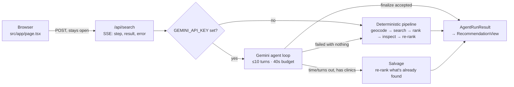
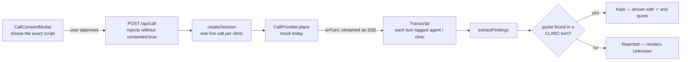

# ClinicScout Internals

A visual walkthrough of how a search actually moves through the app — one
request, traced end to end. [README.md](README.md) covers *why* the
load-bearing decisions were made; [ARCHITECTURE.md](ARCHITECTURE.md) is the
full structural reference, including the layer boundaries under `src/`. This
doc is the guided version of both: follow it top to bottom to see the whole
flow at a glance.

## 1. The big picture

A search is a single `POST /api/search` that stays open as a
Server-Sent-Events stream — the browser never polls; each step renders the
moment it happens. One fork picks the engine, and three different paths can
produce the final recommendation.

Whichever branch runs, the output is the same shape — the client never has to
special-case which engine answered. The deterministic pipeline sits under
*three* of the four paths out of that fork — it's not just a no-key fallback,
it's also what runs when the agent runs out of runway or fails outright.

## 2. One request, three endings

The step log always names which engine answered, because that's exactly the
kind of thing this app is otherwise careful never to leave implicit.

| Outcome | `mode` | When it happens |
|---|---|---|
| **Agent finalized** | `agent` | The model called `finalize_recommendation` and it passed validation. |
| **Salvage** | `deterministic` | The loop ran out of time or turns, or lost the model mid-run — but had already found clinics, so that work gets scored rather than thrown away. |
| **Fixed pipeline** | `deterministic` | No API key configured, or the agent failed before gathering anything at all. |

A geocoding or directory failure raises an error *before* either engine can
produce anything — that path exits ahead of the fork, not after it.

### Why the numbers are what they are

Every budget below is chained to the deployment ceiling, not picked freely.

| Budget | Value | Why |
|---|---|---|
| Vercel Hobby function ceiling | **60s** | The hard limit — `maxDuration` in `src/app/api/search/route.ts` |
| Agent loop budget | **40s** | Leaves room to fall back and still answer rather than dying mid-stream |
| Max turns | **10** | Each turn is a round-trip against a free-tier quota |

## 3. Where state lives

The agent's blackboard is `RunState` (`src/application/search/agentState.ts`), and
the boundary drawn around it is the reason a model can be put in charge of a
medical lookup at all.

**Full clinic records never enter the model's context.** Tools hand Gemini a
compact projection plus a short id like `node/123`, and read the real record
back out by id server-side. Two things follow: a dense city's hundred
listings can't swamp the context window, and it's structurally impossible for
the model to alter a clinic fact — it can only ever point at one.

What accumulates in `RunState` across a run: clinics found so far (deduped by
id, surviving a widened re-search with their inspection results intact),
excluded specialty listings, the radius actually searched, which clinics have
already been inspected, and the finalization once it's accepted.

## 4. The fact firewall

Two different moments ask the same question — *is there anything real behind
this claim?* — and answer it the same way: discard rather than soften.

**Lane A — a fact entering from a website**

A clinic's site is fetched (SSRF-guarded, 3 pages max) and Gemini extracts a
field value plus a claimed supporting quote. `verifyAgainstPage`
(`src/domain/verification/pageEvidence.ts`) checks: does that quote actually
appear on the fetched page, verbatim?

- ✅ **Kept** — written to the record, confidence raised to High
- ❌ **Discarded** — field forced to `null` → renders "Unknown"

**Lane B — a fact the agent cites to justify a pick**

`finalize_recommendation` arrives with a `clinic_id`, a reason, and the
`cited_fields` the reasoning depends on. `validateFinalization`
(`src/application/search/citationGuard.ts`) checks: is every cited field
confirmed (not null) — and is the pick reachable, and not closed while the
request is urgent?

- ✅ **Accepted** — promoted to rank 1, reasoning shown as reasoning
- ❌ **Rejected** — sent back as a tool error — the model retries

Lane A decides what a clinic record is allowed to *contain*. Lane B decides
what the agent is allowed to *say* about it — and carries an extra gate Lane
A doesn't need, because a verified fact can still add up to an unusable
recommendation.

Both lanes, plus the call flow's transcript firewall below, share one
primitive — `findVerbatimMatch` in `src/domain/verification/quoteMatch.ts` —
for the actual "does this quote appear verbatim" check. What differs per lane
is what counts as a searchable source, and that choice is made by each lane
before the shared primitive ever runs, not inside it.

### The usability floor

The agent is free to overrule the deterministic ranking below, and most of
that waterfall really is a judgment call. Two checks aren't, because a wrong
call there hands a sick person a clinic they can't reach or one that's shut —
both were observed happening in testing, which is why they're enforced in
code rather than requested in the prompt.

| Floor | Rule |
|---|---|
| **Reachability** | No address, phone, email, or booking link is a name, not a recommendation — can't be finalized while any reachable alternative exists. |
| **Urgency** | A confirmed-closed clinic can't be finalized for an urgent request while any alternative might be open. Unknown hours pass — unknown might mean open. |

Each check only bites while a genuinely better option exists — if every
nearby clinic is a dead end, saying so honestly is the best answer available,
and the agent is free to give it.

## 5. The priority waterfall

`rank_clinics` (`src/domain/policies/rankClinics.ts`) compares tier by tier —
a tie falls through to the next criterion instead of collapsing into one sort
key. The agent can recommend a lower tier, but only by citing a confirmed
fact the waterfall couldn't see.

| Tier | Criterion | Note |
|---|---|---|
| 0 | Usable at all | No contact channel *and* no address sinks a listing regardless of everything below |
| 1 | Open right now | Confirmed open beats unknown beats confirmed closed |
| 2 | Relevance | `walk_in` > `general` > `unknown` |
| 3 | Walk-ins explicitly confirmed | |
| 4 | Capacity or wait time known | |
| 5 | No appointment required | Skipped for routine care — you can book ahead |
| 6 | Reachable by some contact channel | Deliberately above distance: reachable beats 100m closer but silent |
| 7 | Shortest distance | |
| 8 | Higher source confidence | |

## 6. Teaching the agent to call a clinic

The one fact that decides whether a trip is worth making — *are you taking
walk-ins right now* — lives nowhere but in a receptionist's head. It's a
separate, user-initiated flow: the search loop budgets 40s for a whole run,
and a phone call is minutes.

A provider only ever produces speech; turning speech into a claimed fact, and
a claimed fact into a confirmed one, happens after the line is down — in code
the provider cannot influence.

**Why the haystack excludes the agent's own words:** half a transcript is the
agent talking. An agent that asks *"so that's about forty-five minutes?"* and
gets a noncommittal "mhm" could, given the whole transcript, quote its own
sentence as proof — a number the clinic never said. Restricting the haystack
to clinic turns removes the possibility in code, the same move the app makes
everywhere it puts a model near a claim.

### Constraints carried by the design, not the prompt

| Concern | Where it's enforced |
|---|---|
| Undisclosed AI caller | `DISCLOSURE` is a constant at index 0 of `buildScript` — never model-generated, always first |
| Patient detail leaking | The script has exactly one slot — the clinic's name. `buildScript.length === 1` is asserted in the test suite |
| Booking something unreviewed | No commitment path exists in this phase — it asks and hangs up |
| Repeated calls to one clinic | `activeSessionFor` — one live session per clinic |
| A call that never ends | `MAX_CALL_MS` plus the user's abort, combined into one signal in `runCall` |
| Mining a voicemail for facts | `buildOutcome` discards all findings unless the call status is `completed` |

Today it dials a scripted receptionist — seven personas cover the failure
modes a real line produces: helpful, appointment-only, vague, refuses-AI,
voicemail, phone tree, no answer. Everything above the provider boundary is
real, so live telephony is an adapter swap, not a rewrite — deliberately not
wired up yet, since it needs a verified caller ID, a number allowlist, rate
limits, and a look at the AI-voice disclosure rules for the jurisdiction
being dialled into.

## 7. Where each piece lives

All paths are under `src/`. See [ARCHITECTURE.md](ARCHITECTURE.md#layering)
for what belongs in each layer and why.

<strong>Presentation — client, 15 modules</strong>

| Module | Role |
|---|---|
| `app/page.tsx` | Phase state machine — input, searching, progress, recommendation, error |
| `InputForm.tsx` | Location, urgency and radius |
| `SearchingState.tsx` | Pre-stream spinner; speaks up if the directory is slow past 12s |
| `AgentProgress.tsx` | Live transparency log — one line per streamed step |
| `RecommendationView.tsx` | Best pick, alternatives, agent rationale, set-aside specialty listings |
| `ClinicCard.tsx` | One clinic, with a ✓ on each field quoted from its own site |
| `FieldValue.tsx` | The only renderer for a nullable field — always "Unknown", never a guessed "No" |
| `ActionPanel.tsx` | Renders whichever next action `determineAction` selected |
| `EmailDraftModal.tsx` | Editable draft, explicitly mocked — nothing is ever sent |
| `EmergencyBanner.tsx` | Sits above results when the request is emergency-adjacent |
| `ErrorState.tsx` | Renders an AgentError by kind, with a retry |
| `components/hooks/useStreamedSse.ts` | Owns the fetch+SSE `AbortController` lifecycle for both the search and call flows |
| `shared/sse/postAndStream.ts` | Framework-agnostic POST + SSE-read loop the hook wraps |
| `shared/sse/sseFrame.ts` | Hand-rolled SSE frame parser — `EventSource` can't issue a POST |
| `domain/policies/determineAction.ts` | Pure next-action routing |

<strong>Interface &amp; application — search orchestration, 10 modules</strong>

| Module | Role |
|---|---|
| `app/api/search/route.ts` | Thin controller — parse, validate, call the use-case, SSE-frame events |
| `interface/http/sseResponse.ts` | Shared SSE `Response` builder used by both `/api/search` and `/api/call` |
| `application/search/runClinicSearchUseCase.ts` | `runClinicSearch()` — picks the engine, always announces which one answered |
| `application/search/runDeterministicPipelineUseCase.ts` | `runDeterministicPipeline()` — the fixed pipeline, also the fallback |
| `application/search/runGeminiAgentUseCase.ts` | The turn loop: system instruction, budget, turn cap, one nudge to finalize, salvage on early exit |
| `application/search/agentState.ts` | `RunState` blackboard and the projection boundary |
| `application/search/citationGuard.ts` | `validateFinalization()` — the citation check and the usability floor |
| `application/search/inspectClinicUseCase.ts` | Runs one website's extraction, verification, caching and merge back into the record |
| `application/search/tools/index.ts` + 8 more | The six tools (one file each), `shared.ts`, `stepMessages.ts` |
| `application/ports/*.ts` | The 9 interfaces application code depends on instead of concrete infrastructure |

<strong>Domain — entities, policies, verification, 15 modules</strong>

| Module | Role |
|---|---|
| `domain/entities/clinic.ts` | `Clinic`, `RankedClinic`, `clinicShortId`, and related types |
| `domain/entities/agentRun.ts` | `AgentStep`, `AgentReasoning`, `AgentRunResult`, `InputFormData` |
| `domain/entities/errors.ts` | `AgentError` |
| `domain/entities/call.ts` | Call-flow entities |
| `domain/policies/classifyClinic.ts` | Tiers a listing walk_in / general / specialty / unknown — downgrades only on positive evidence |
| `domain/policies/calculateDistance.ts` | Great-circle distance, labelled straight-line rather than routing |
| `domain/policies/rankClinics.ts` | The waterfall, plus per-clinic rationale text |
| `domain/policies/actionability.ts` | `hasContactChannel` / `isLocatable` / `isDeadEnd` — shared by ranking, guards and UI |
| `domain/policies/excludeSpecialtyListings.ts` | `partitionBySpecialty` — shared by the agent path and the deterministic pipeline |
| `domain/policies/openingHours.ts` | Conservative OSM opening_hours parser — unsupported syntax returns null, never a guess |
| `domain/services/draftAppointmentEmail.ts` | Pure template function |
| `domain/services/callScript.ts` | The bounded call script, disclosure, refusal/IVR/voicemail detectors |
| `domain/verification/quoteMatch.ts` | `findVerbatimMatch` — the primitive both fact-firewall lanes share |
| `domain/verification/pageEvidence.ts` | Website-claim verification |
| `domain/verification/transcriptEvidence.ts` | Call-transcript verification (clinic-turns-only) |

<strong>Infrastructure — adapters, 10 modules</strong>

| Module | Role |
|---|---|
| `infrastructure/geo/nominatimGeocoder.ts` | Nominatim lookup |
| `infrastructure/geo/overpassClinicDirectory.ts` | Overpass query with retry/backoff; 24h cache serving stale over nothing |
| `infrastructure/web/httpWebsiteFetcher.ts` | SSRF-guarded fetch, HTML-to-text, same-origin link discovery |
| `infrastructure/llm/geminiHttpClient.ts` | Shared transport for both Gemini adapters below |
| `infrastructure/llm/geminiJsonClient.ts` | Single-shot structured-JSON extraction client; returns null on any failure |
| `infrastructure/llm/geminiFunctionCallClient.ts` | Function-calling client |
| `infrastructure/cache/ttlCache.ts` | TTL cache with an injectable clock and a deliberate stale read |
| `infrastructure/config/env.ts` | The one place `GEMINI_API_KEY`/`GEMINI_MODEL` are read from `process.env` |
| `infrastructure/call/mockCallProvider.ts` | Seven scripted receptionists, one per real-world failure mode |
| `infrastructure/call/inMemoryCallSessionStore.ts` | The Map-based call session store |

## 8. Tests & failure handling

`node --test` over `src/**/*.test.ts`, colocated beside the source each file
tests. No network access — the agent loop takes `callModel` and `runTool` as
parameters precisely so a whole run can be driven from a scripted transcript
without a key.

| Stat | Value |
|---|---|
| Repeat search, cache hit vs. cold | **~7s → ~400ms** (confirmed live) |
| Overpass result cache TTL | **24h** — expired cache still beats no result |
| `gemini-2.5-flash` free-tier request cap | **20/day** ≈ 3 agent runs |

Coverage leans toward the places where being wrong would be *dangerous*
rather than merely incorrect:

- `citationGuard.test.ts` — the citation check and both usability floors
- `runGeminiAgentUseCase.test.ts` — budget and turn-cap termination, salvage, the finalize nudge
- `pageEvidence.test.ts` — fabricated and paraphrased quotes dropping their fields
- `openingHours.test.ts` — the parser refusing to guess
- `classifyClinic.test.ts` — specialty names beating walk-in names
- `transcriptEvidence.test.ts` — the call firewall, including a quote lifted from the agent's own turn
- `callScript.test.ts` — disclosure first, no slot able to carry patient detail
- `callSessionService.test.ts` — lifecycle transitions, hang-up at every live stage, one call per clinic
- `mockCallProvider.test.ts` — each persona's terminal status, the vague clinic confirming nothing
- `excludeSpecialtyListings.test.ts` — the agent path and deterministic pipeline agreeing on the same input

Model pinned to `gemini-2.5-flash` rather than an alias —
`gemini-flash-latest` resolved to a preview model with a much tighter quota
and caused a live 429 storm during testing. A demo failing under load is
worse than eventually bumping a pinned id by hand.
